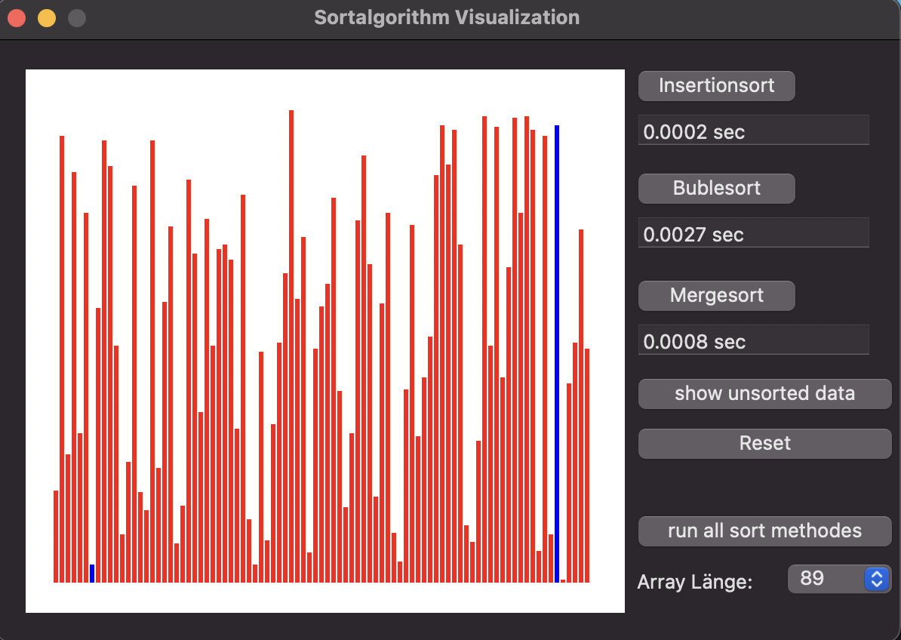

# 📊 Sortalgorithm_Visualization
`Swift - 2018`

A small macOS application to illustrate and compare different sorting algorithms.

It compares insertion sort, bubblesort and mergesort.

Each algorithm sorts an array with 89 to 10000 entries.
For each algorithm the required time is measured. The larger the array, the greater the time difference. 

To understand how the algorithms work, they can be clicked through step by step with an array of 89 values.

 
